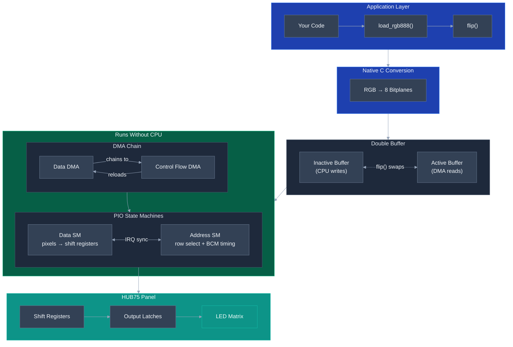

# Pi Pico HUB75 Driver

*This is a full rewrite of [my original project from High School](https://github.com/dgrantpete/pi-pico-hub75-driver/tree/8479f60).*

A high-performance MicroPython driver for HUB75 LED matrix panels on the Raspberry Pi Pico.

- **PIO + DMA** - CPU-free display refresh
- **Double buffered** - Flicker-free updates
- **Native C modules** - Fast color conversion and bitplane packing
- **Flexible** - Supports various panel sizes and configurations
- **Compatible** - Works with RP2040 and RP2350 boards

## Performance

Benchmarks on a 64x64 panel:

| Chip | Format | Frame Time | Max FPS |
|------|--------|------------|---------|
| RP2040 | RGB888 | 4.8 ms | ~207 |
| RP2040 | RGB565 | 5.7 ms | ~175 |
| RP2350 | RGB888 | 2.2 ms | ~448 |
| RP2350 | RGB565 | 2.6 ms | ~390 |

## Hardware Requirements

- Raspberry Pi Pico (RP2040) or Pico 2 (RP2350)
- HUB75 LED matrix panel (e.g., 64x64, 64x32)
- Jumper wires

## Wiring

Default pin configuration for **direct addressing** panels (editable in `main.py`):

| HUB75 Pin | GPIO | Description |
|-----------|------|-------------|
| R1 | 0 | Red (upper half) |
| G1 | 1 | Green (upper half) |
| B1 | 2 | Blue (upper half) |
| R2 | 3 | Red (lower half) |
| G2 | 4 | Green (lower half) |
| B2 | 5 | Blue (lower half) |
| CLK | 6 | Pixel clock |
| LAT | 7 | Latch |
| OE | 8 | Output enable |
| A | 9 | Row address bit 0 |
| B | 10 | Row address bit 1 |
| C | 11 | Row address bit 2 |
| D | 12 | Row address bit 3 (if present on panel) |
| E | 13 | Row address bit 4 (if present on panel) |

For **shift register addressing** panels, the address pins carry different signals:

| HUB75 Pin | GPIO | Description |
|-----------|------|-------------|
| A | — | Shift register clock |
| B | — | Shift register enable (directly connect to GND or hold low externally) |
| C | — | Shift register data |

See [Row Addressing](#row-addressing) for how to identify which type your panel uses.

Connect GND from the Pico to GND on the HUB75 panel.

## Installation

### Option 1: mip (Recommended)

Install the library using MicroPython's package manager.

**From your computer (via mpremote):**
```bash
mpremote mip install https://github.com/dgrantpete/pi-pico-hub75-driver/releases/latest/download/package.json
```

**On-device (requires network connection):**
```python
import mip
mip.install("https://github.com/dgrantpete/pi-pico-hub75-driver/releases/latest/download/package.json")
```

### Option 2: Download Zip

1. Download the latest `hub75-vX.X.X.zip` from [Releases](https://github.com/dgrantpete/pi-pico-hub75-driver/releases/latest)
2. Extract and copy contents to your Pico

### Option 3: Build from Source

See [Building from Source](#building-from-source) below.

---

### Release vs Dev Versions

Each release includes two variants:

| Version | Files | Includes | Best for |
|---------|-------|----------|----------|
| Release | `package.json`, `hub75-vX.X.X.zip` | Compiled `.mpy` files | Production use |
| Dev | `package-dev.json`, `hub75-vX.X.X-dev.zip` | Source `.py` files + benchmarks | Debugging, development |

To install the dev version via mip:
```bash
mpremote mip install https://github.com/dgrantpete/pi-pico-hub75-driver/releases/latest/download/package-dev.json
```

---

### Running the Demo

The mip package includes only the library. To run the interactive demo:

1. Download [`main.py`](src/main.py) from this repository
2. Edit the pin configuration to match your wiring
3. Copy to your Pico's root directory
4. Reboot - the demo runs automatically

Alternatively, download the full zip from [Releases](https://github.com/dgrantpete/pi-pico-hub75-driver/releases/latest) which includes `main.py`.

## Usage

### Interactive Demo

The included `main.py` runs a visual demo on startup. Access the REPL to control it:

```python
# On boot, cycle() runs automatically — rotating through all effects

cycle()          # Cycle through all effects (default on boot)
balatro()        # Animated spiral effect
plasma()         # Classic plasma effect
fire()           # Doom-style fire effect
spiral()         # Rainbow spiral
stop()           # Stop the current effect

# Runtime display controls
brightness(0.5)                    # Set brightness (0.0 - 1.0)
blanking_time(1000)                # Set blanking time in ns (reduces ghosting)
gamma(gamma_module.SRGB())         # sRGB gamma (default)
gamma(gamma_module.Power(2.2))     # Simple power-function gamma
gamma(None)                        # No gamma correction
refresh_rate(120)                  # Set target refresh rate in Hz

print_pinout()       # Show wiring for your configuration
```

### Basic Usage

```python
from hub75 import Hub75Driver, Hub75Display, row_addressing
from machine import Pin

# Initialize driver (most panels use Direct addressing)
driver = Hub75Driver(
    row_addressing=row_addressing.Direct(
        base_pin=Pin(9),        # First address GPIO (consecutive pins for each address line)
        bit_count=5             # Number of address pins on your panel
    ),
    shift_register_depth=64,    # Panel width
    base_data_pin=Pin(0),
    base_clock_pin=Pin(6),
    output_enable_pin=Pin(8),
    # Optional parameters (showing defaults):
    # brightness=1.0,               # Display brightness (0.0 - 1.0)
    # gamma=gamma.SRGB(),           # Gamma correction (SRGB, Power, or None)
    # blanking_time=0,              # Dead time in ns to reduce ghosting
    # target_refresh_rate=120.0     # Target refresh rate in Hz
)

# Use the display wrapper for drawing
display = Hub75Display(driver)
display.fill(0x0000)           # Clear to black
display.rect(10, 10, 20, 20, 0xF800, fill=True)  # Red rectangle
display.show()                 # Update the display
```

### Direct Driver Access

For maximum performance, use the driver directly:

```python
# Create an RGB888 buffer (width * height * 3 bytes)
buffer = bytearray(64 * 64 * 3)

# Fill with your pixel data...

# Update display
driver.load_rgb888(buffer)
driver.flip()
```

## How It Works

The driver achieves CPU-free display refresh using the RP2040/RP2350's PIO and DMA peripherals:



**After `flip()`, the CPU is completely free** — the hardware takes over and continuously refreshes the display. Here's what's happening under the hood:

### The Pipeline

1. **Native C Conversion**: Your RGB data is transformed into 8 bitplanes. Each bitplane holds one bit of color depth for all pixels, packed as 6-bit values (R1,G1,B1,R2,G2,B2) for simultaneous dual-row output.

2. **Double Buffering**: Two frame buffers alternate roles. The CPU writes to the inactive buffer while DMA reads from the active one. `flip()` atomically swaps a pointer — no tearing, no blocking.

3. **DMA Chain**: Two DMA channels form a self-sustaining loop. The Data DMA streams bitplane data to the PIO, then chains to the Control Flow DMA, which reloads the Data DMA's read address and restarts the cycle.

4. **PIO State Machines**: Two state machines run in parallel, synchronized via hardware IRQs:
   - **Data SM**: Clocks pixel data into the panel's shift registers and controls the latch signal
   - **Address SM**: Outputs the row address and generates precise BCM timing delays

5. **Binary Code Modulation (BCM)**: Instead of traditional PWM, each bitplane is displayed with exponentially weighted timing (1:2:4:8:16:32:64:128). This creates 256 brightness levels per color channel with just 8 display passes per frame

## Panel Configuration Guide

HUB75 panels come in many sizes and scan rates. This section explains how to read your panel's specs and configure the driver.

### Reading Your Panel

Most panels have a label on the back with specs like:

```
64x64  1/32S  Indoor
```

The key values are:
- **Resolution** (e.g., `64x64`): Width × Height in pixels
- **Scan rate** (e.g., `1/32S`): How many rows are lit simultaneously

### Understanding Scan Rate

HUB75 panels use **multiplexing** — they don't light all rows at once. Instead, they rapidly cycle through addresses, lighting a fraction of rows at any moment.

*You can watch this happen in real time by lowering the data frequency below about 10 KHz with `driver.set_frequency(10_000)`; you'll see only a few rows lit up at a time.*

The scan rate tells you what fraction of rows are lit simultaneously:
- **1/32 scan**: 1/32 of the rows are lit at once (e.g., 2 rows on a 64-row panel)
- **1/16 scan**: 1/16 of the rows lit (e.g., 2 rows on a 32-row panel)
- **1/8 scan**: 1/8 of the rows lit (e.g., 2 rows on a 16-row panel, or 4 rows on a 32-row outdoor panel)

**Standard indoor panels** light 2 rows at a time. **Outdoor panels** with lower scan rates (1/4, 1/2) may light 4+ rows at a time for increased brightness.

### Row Addressing

HUB75 panels use two different methods to select which row is active. **Most panels use direct addressing** — if you're unsure, start with direct addressing.

#### Direct Addressing (most panels)

The most common type. The panel has binary address pins that directly select the active row. The number of address pins varies by panel — for example, 4 pins (A-D) can select 16 rows, and 5 pins (A-E) can select 32 rows.

**How to identify:** Most standard indoor panels use direct addressing. If you're unsure which type your panel uses, start here — if the rows display incorrectly (only one row lights up, or rows appear in the wrong order), try shift register addressing instead.

```python
from hub75 import Hub75Driver, row_addressing
from machine import Pin

driver = Hub75Driver(
    row_addressing=row_addressing.Direct(
        base_pin=Pin(9),    # First address GPIO (consecutive pins for each address line)
        bit_count=5          # Number of address pins on your panel
    ),
    shift_register_depth=64,
    base_data_pin=Pin(0),
    base_clock_pin=Pin(6),
    output_enable_pin=Pin(8),
)
```

| Address Pins | `bit_count` | Scan Rate |
|--------------|-------------|-----------|
| A, B, C      | 3           | 1/8       |
| A, B, C, D   | 4           | 1/16      |
| A, B, C, D, E| 5           | 1/32      |

The address pins must be on **consecutive GPIOs** starting from `base_pin`.

#### Shift Register Addressing (some panels)

Some panels — particularly certain outdoor panels, very large panels, or panels with high row counts — use a shift register chain to select the active row instead of binary address pins. Rather than outputting a binary address, the driver clocks a single '1' bit through the shift register, and the position of that bit determines which row is active.

**How to identify:** If your panel doesn't work with direct addressing (wrong rows light up, or only one row works), it may use shift register addressing. The HUB75 connector's address pins (A, B, C) serve different roles:
- **A** = shift register clock
- **B** = shift register enable (active low — connect to GND or hold low externally)
- **C** = shift register data input

```python
from hub75 import Hub75Driver, row_addressing
from machine import Pin

# Hold the enable pin low (do this before constructing the driver)
enable_pin = Pin(10, Pin.OUT, value=0)

driver = Hub75Driver(
    row_addressing=row_addressing.ShiftRegister(
        clock_pin=Pin(9),    # Shift register clock (HUB75 pin A)
        data_pin=Pin(11),    # Shift register data (HUB75 pin C)
        depth=32              # Number of addressable rows
    ),
    shift_register_depth=64,
    base_data_pin=Pin(0),
    base_clock_pin=Pin(6),
    output_enable_pin=Pin(8),
)
```

The `depth` parameter is the number of distinct row addresses the shift register cycles through. This is equivalent to the scan rate denominator (e.g., 32 for a 1/32 scan panel, 16 for a 1/16 scan panel).

**Optional: `clock_frequency`** — By default, the shift register is clocked at the same rate as `data_frequency`. If your shift register IC requires a different speed, you can set it explicitly:

```python
row_addressing.ShiftRegister(
    clock_pin=Pin(9),
    data_pin=Pin(11),
    depth=32,
    clock_frequency=10_000_000  # 10 MHz shift register clock
)
```

The driver will raise an error if the requested clock frequency is too low to achieve with the available PIO timing. In that case, the error message will tell you the minimum achievable frequency.

#### `shift_register_depth`
The number of pixels clocked into the panel per address cycle. For **standard indoor panels**, this equals the panel width.

**Outdoor panels** with lower scan rates (1/4, 1/2) may light more than 2 rows simultaneously. These panels often require clocking in more data per address — for example, `width × 2` pixels if 4 rows light at once. In this case, set `shift_register_depth` to the total pixels per cycle, not just the panel width.

### Gamma Correction

The driver supports three gamma correction modes:

```python
from hub75 import Hub75Driver, gamma

# sRGB gamma with linear region (default) — best for most displays
driver = Hub75Driver(..., gamma=gamma.SRGB())

# Simple power-function gamma — traditional approach
driver = Hub75Driver(..., gamma=gamma.Power(2.2))

# No gamma correction — linear output
driver = Hub75Driver(..., gamma=None)
```

Gamma correction can also be changed at runtime with `driver.set_gamma(...)`.

### Common Panel Configurations

**Standard indoor panels** (2 rows lit at a time, direct addressing):

| Panel | Scan Rate | `bit_count` | `shift_register_depth` |
|-------|-----------|-------------|------------------------|
| 32×16 | 1/8       | 3           | 32                     |
| 32×32 | 1/16      | 4           | 32                     |
| 64×32 | 1/16      | 4           | 64                     |
| 64×64 | 1/32      | 5           | 64                     |
| 128×64| 1/32      | 5           | 128                    |

**Outdoor panels** (4+ rows lit at a time):

| Panel | Scan Rate | `bit_count` | `shift_register_depth` |
|-------|-----------|-------------|------------------------|
| 64×32 | 1/8       | 3           | 128                    |
| 64×32 | 1/4       | 2           | 256                    |

For outdoor panels, `shift_register_depth = width × (rows_lit_at_once / 2)`.

### Complete Configuration Example

For a **64×64 panel with 1/32 scan** (direct addressing):

```python
from hub75 import Hub75Driver, row_addressing
from machine import Pin

driver = Hub75Driver(
    row_addressing=row_addressing.Direct(
        base_pin=Pin(9),        # Address lines on consecutive GPIOs starting here
        bit_count=5              # Number of address pins (5 for 1/32 scan)
    ),
    shift_register_depth=64,    # 64 pixels wide
    base_data_pin=Pin(0),       # R1,G1,B1,R2,G2,B2 on GPIO 0-5
    base_clock_pin=Pin(6),      # CLK,LAT on GPIO 6-7
    output_enable_pin=Pin(8),   # OE on GPIO 8
    data_frequency=25_000_000   # 25 MHz pixel clock
)
```

### Chaining Multiple Panels

For **horizontally chained** panels (e.g., two 64×64 panels side by side = 128×64):
- Increase `shift_register_depth` to total width (128)
- Keep `row_addressing` the same

```python
# Two 64x64 panels chained horizontally
driver = Hub75Driver(
    row_addressing=row_addressing.Direct(
        base_pin=Pin(9),
        bit_count=5
    ),
    shift_register_depth=128,   # 64 + 64 = 128 pixels wide
    ...
)
```

### Troubleshooting

**Wrong colors or ghosting?**
- Try increasing `blanking_time` (e.g., `driver.set_blanking_time(1000)` for 1000 ns of dead time between rows)
- Try reducing `data_frequency` (e.g., 20 MHz instead of 25 MHz)
- Check your wiring — especially ground connections

**Only half the panel lights up or there are rows mixed up?**
- Ensure `shift_register_depth` matches your panel width or total pixels per cycle
- Check `bit_count` — you may need more address lines
- Verify your panel's actual scan rate matches your config

**Only one row lights up, or rows appear in the wrong order?**
- Your panel may use shift register addressing instead of direct addressing. See [Shift Register Addressing](#shift-register-addressing-some-panels) above.

**Flickering or dim display?**
- Ensure adequate 5V power supply (panels can draw 2-4A at full brightness)
- Try adjusting `data_frequency`
- Check brightness with `driver.set_brightness(1.0)` to ensure it's at maximum

### Pin Configuration

Edit the pin constants to match your wiring:

```python
BASE_DATA_PIN = 0       # First GPIO for R1,G1,B1,R2,G2,B2 (consecutive)
BASE_CLOCK_PIN = 6      # First GPIO for CLK,LAT (consecutive)
OUTPUT_ENABLE_PIN = 8   # GPIO for OE
BASE_ADDRESS_PIN = 9    # First GPIO for address lines (consecutive for Direct)
```

The driver expects pins in consecutive groups:
- **Data pins**: 6 consecutive GPIOs (R1, G1, B1, R2, G2, B2)
- **Clock pins**: 2 consecutive GPIOs (CLK, LAT)
- **Address pins (Direct)**: Consecutive GPIOs for each address line on your panel (varies by scan rate)
- **Address pins (ShiftRegister)**: Clock and data pins specified individually

## API Reference

### Hub75Driver

Low-level driver for direct hardware control.

**Constructor:**

```python
Hub75Driver(
    *,
    row_addressing: row_addressing.Direct | row_addressing.ShiftRegister,
    shift_register_depth: int,
    base_data_pin: Pin,
    base_clock_pin: Pin,
    output_enable_pin: Pin,
    pio: PIO | None = None,
    data_frequency: int = 20_000_000,
    brightness: float = 1.0,
    gamma: gamma.SRGB | gamma.Power | None = gamma.SRGB(),
    blanking_time: int = 0,
    target_refresh_rate: float = 120.0
)
```

**Row addressing types:**

| Type | Parameters | Description |
|------|-----------|-------------|
| `row_addressing.Direct(base_pin, bit_count)` | `base_pin`: first address GPIO, `bit_count`: number of address pins | Standard binary address pins |
| `row_addressing.ShiftRegister(data_pin, clock_pin, depth, clock_frequency=None)` | `data_pin`: data GPIO, `clock_pin`: clock GPIO, `depth`: addressable rows, `clock_frequency`: optional clock speed | Shift register row selection |

**Frame Operations:**

| Method | Description |
|--------|-------------|
| `load_rgb888(buffer)` | Load RGB888 pixel data (3 bytes per pixel). Applies gamma correction. |
| `load_rgb565(buffer)` | Load RGB565 pixel data (2 bytes per pixel). Applies gamma correction. |
| `flip()` | Swap buffers to display the loaded frame |
| `clear()` | Clear the inactive buffer |
| `deinit()` | Graceful shutdown of DMA chains, PIO state machines, and programs |

**Display Control:**

| Method | Returns | Description |
|--------|---------|-------------|
| `set_brightness(brightness)` | `float` | Set display brightness (0.0 - 1.0) |
| `set_blanking_time(nanoseconds)` | `int` | Set dead time in ns between row switches to reduce ghosting |
| `set_gamma(gamma)` | `SRGB \| Power \| None` | Set gamma correction mode |
| `set_target_refresh_rate(target_refresh_rate)` | `float` | Set target refresh rate in Hz. Returns closest achievable rate. |
| `set_frequency(data_frequency)` | `int` | Set the PIO data clock frequency in Hz |
| `sync_system_frequency()` | `int` | Re-sync internal timings after changing `machine.freq()` |

**Properties (read-only):**

| Property | Type | Description |
|----------|------|-------------|
| `brightness` | `float` | Current brightness (0.0 - 1.0) |
| `blanking_time` | `int` | Current blanking time in nanoseconds |
| `gamma` | `SRGB \| Power \| None` | Current gamma correction mode |
| `refresh_rate` | `float` | Current estimated refresh rate in Hz |
| `data_frequency` | `int` | Current PIO data clock frequency |
| `system_frequency` | `int` | Cached system clock frequency |
| `row_address_count` | `int` | Number of row addresses |
| `shift_register_depth` | `int` | Pixels per row shift |

### Hub75Display

FrameBuffer subclass for drawing to HUB75 panels. Compatible with MicroPython libraries that expect a FrameBuffer device (e.g. writer.py, CWriter).

- `show()` - Load buffer and flip
- `fill(color)` - Fill with RGB565 color
- `pixel(x, y, color)` - Set/get pixel
- `line()`, `hline()`, `vline()` - Draw lines
- `rect()`, `fill_rect()` - Draw rectangles
- `ellipse()` - Draw ellipses
- `text(string, x, y, color)` - Draw text
- `blit()`, `scroll()` - Buffer operations

## Current Limitations

HUB75 panels vary widely in their internal design. This driver works great with almost all indoor panels, but some panels use non-standard configurations that aren't yet supported.

### Currently Unimplemented Features

**Non-linear addressing** — Some panels don't use standard binary row addressing (where A=bit 0, B=bit 1, etc.). The address lines may be remapped or interleaved in panel-specific ways. See [this ESPHome documentation](https://esphome.io/components/display/hub75/) for examples of different addressing modes.

**Serpentine scan patterns** — Some panels clock data in alternating directions on each row. This requires pixel remapping that isn't currently implemented. The [PxMatrix library](https://github.com/2dom/PxMatrix) documents many of these scan patterns.

**Driver chip initialization** — Some LED driver chips require a special initialization sequence at power-up before they display correctly:

| Chip | Notes |
|------|-------|
| FM6124 | Requires init sequence + modified latch timing |
| FM6126A | 2 config registers, latch during last 3 bits |
| FM6127 | 3 config registers |
| MBI5124 | May need configuration for some panels |

If your panel stays dark or displays garbage, it may use one of these chips. Check for markings on the driver ICs on the back of your panel.

### Help Wanted

I'm happy to add support for these features if you need them, but I need your help since I can't test every panel type.

**If your panel doesn't work:**
1. [Open an issue](https://github.com/dgrantpete/pi-pico-hub75-driver/issues) with your panel specs (size, scan rate, driver chip if visible)
2. Be willing to test a few iterations with me
3. Together we can figure out what your panel configuration needs

The HUB75 ecosystem has a lot of variation, and I want this driver to work for as many people as possible, so your help is greatly appreciated!

## Building from Source

Building from source compiles the native C modules and Python files to `pico/`.

### Prerequisites

- **Python 3.x**
- **Git** (with submodule support)
- **GNU Make**
- **ARM GCC Toolchain** (`arm-none-eabi-gcc`)

### Installing Dependencies

**ARM GCC Toolchain:**
- Windows: [Arm GNU Toolchain Downloads](https://developer.arm.com/downloads/-/arm-gnu-toolchain-downloads)
- macOS: `brew install arm-none-eabi-gcc`
- Linux (Debian/Ubuntu): `sudo apt install gcc-arm-none-eabi`

**GNU Make:**
- Windows: Install via [MSYS2](https://www.msys2.org/) or use WSL
- macOS/Linux: Usually pre-installed

### Build Steps

```bash
# Clone with submodules
git clone --recursive https://github.com/dgrantpete/pi-pico-hub75-driver.git

# Or if already cloned, initialize submodules
git submodule update --init

# Install Python dependencies
pip install -r requirements.txt

# Build
python tools/build.py
```

Output files are placed in `pico/`.

## License

MIT License - see [LICENSE](LICENSE).
