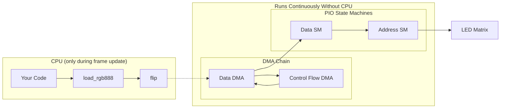

# Pi Pico HUB75 Driver

*This is a full rewrite of [my original project from High School](../../../tree/8479f60).*

A high-performance MicroPython driver for HUB75 LED matrix panels on the Raspberry Pi Pico.

- **PIO + DMA** - CPU-free display refresh
- **Double buffered** - Flicker-free updates
- **Native C modules** - Fast color conversion and bitplane packing
- **Flexible** - Supports various panel sizes and configurations
- **Compatible** - Works with RP2040 and RP2350 boards

## Performance

Benchmarks on a 64x64 panel:

| Chip | Format | Frame Time | Max FPS |
|------|--------|------------|---------|
| RP2040 | RGB888 | 4.8 ms | ~207 |
| RP2040 | RGB565 | 5.7 ms | ~175 |
| RP2350 | RGB888 | 2.2 ms | ~448 |
| RP2350 | RGB565 | 2.6 ms | ~390 |

The RP2350 is approximately 2x faster than the RP2040 for frame updates.

## Hardware Requirements

- Raspberry Pi Pico (RP2040) or Pico 2 (RP2350)
- HUB75 LED matrix panel (e.g., 64x64, 64x32)
- Jumper wires

## Wiring

Default pin configuration (editable in `main.py`):

| HUB75 Pin | GPIO | Description |
|-----------|------|-------------|
| R1 | 0 | Red (upper half) |
| G1 | 1 | Green (upper half) |
| B1 | 2 | Blue (upper half) |
| R2 | 3 | Red (lower half) |
| G2 | 4 | Green (lower half) |
| B2 | 5 | Blue (lower half) |
| CLK | 6 | Pixel clock |
| LAT | 7 | Latch |
| OE | 8 | Output enable |
| A | 9 | Row address bit 0 |
| B | 10 | Row address bit 1 |
| C | 11 | Row address bit 2 |
| D | 12 | Row address bit 3 |
| E | 13 | Row address bit 4 (for 64-row panels) |

Connect GND from the Pico to GND on the HUB75 panel.

## Installation

1. Clone or download this repository
2. Copy the contents of `pico/` to your Pico (using Thonny, mpremote, or similar)
3. Edit `main.py` to match your panel configuration if needed
4. Reboot the Pico

The demo runs automatically on boot.

## Usage

### Interactive Demo

The included `main.py` runs a visual demo on startup. Access the REPL to control it:

```python
balatro()   # Animated spiral effect
plasma()    # Classic plasma effect
fire()      # Doom-style fire effect
spiral()    # Rainbow spiral
stop()      # Stop the current effect

print_pinout()  # Show wiring for your configuration
```

### Basic Usage

```python
from hub75 import Hub75Driver, Hub75Display
from machine import Pin

# Initialize driver
driver = Hub75Driver(
    address_bit_count=5,        # 5 for 64-row panels (1/32 scan)
    shift_register_depth=64,    # Panel width
    base_data_pin=Pin(0),
    base_clock_pin=Pin(6),
    output_enable_pin=Pin(8),
    base_address_pin=Pin(9)
)

# Use the display wrapper for drawing
display = Hub75Display(driver)
display.fill(0x0000)           # Clear to black
display.rect(10, 10, 20, 20, 0xF800, fill=True)  # Red rectangle
display.show()                 # Update the display
```

### Direct Driver Access

For maximum performance, use the driver directly:

```python
# Create an RGB888 buffer (width * height * 3 bytes)
buffer = bytearray(64 * 64 * 3)

# Fill with your pixel data...

# Update display
driver.load_rgb888(buffer)
driver.flip()
```

## How It Works

The driver achieves CPU-free display refresh using the RP2040/RP2350's PIO and DMA peripherals:



**After `flip()`, the CPU is completely free.** The DMA chain continuously streams pixel data to the PIO state machines, which handle all timing-critical operations:

- **Data SM**: Clocks pixels out to the shift registers
- **Address SM**: Multiplexes rows and controls PWM timing for color depth
- **Double buffering**: Write to the inactive buffer while the active one displays

## Configuration

Edit the constants at the top of `main.py` to match your setup:

```python
WIDTH = 64              # Panel width in pixels
HEIGHT = 64             # Panel height in pixels
BASE_DATA_PIN = 0       # First GPIO for R1,G1,B1,R2,G2,B2
BASE_CLOCK_PIN = 6      # First GPIO for CLK,LAT
OUTPUT_ENABLE_PIN = 8   # GPIO for OE
BASE_ADDRESS_PIN = 9    # First GPIO for address lines
DATA_FREQUENCY = 20_000_000  # Data clock speed (adjust if you see artifacts)
```

## API Reference

### Hub75Driver

Low-level driver for direct hardware control.

- `load_rgb888(buffer)` - Load RGB888 pixel data (3 bytes per pixel)
- `load_rgb565(buffer)` - Load RGB565 pixel data (2 bytes per pixel)
- `flip()` - Swap buffers to display the loaded frame
- `clear()` - Clear the inactive buffer
- `set_frequency(data_frequency, address_frequency)` - Adjust timing
- `deinit()` - Clean shutdown

### Hub75Display

High-level wrapper with MicroPython FrameBuffer compatibility.

- `show()` - Load buffer and flip
- `fill(color)` - Fill with RGB565 color
- `pixel(x, y, color)` - Set/get pixel
- `line()`, `hline()`, `vline()` - Draw lines
- `rect()`, `fill_rect()` - Draw rectangles
- `ellipse()` - Draw ellipses
- `text(string, x, y, color)` - Draw text
- `blit()`, `scroll()` - Buffer operations

## Building from Source

Building from source compiles the native C modules and Python files to `pico/`.

### Prerequisites

- **Python 3.x**
- **Git** (with submodule support)
- **GNU Make**
- **ARM GCC Toolchain** (`arm-none-eabi-gcc`)

### Installing Dependencies

**ARM GCC Toolchain:**
- Windows: [Arm GNU Toolchain Downloads](https://developer.arm.com/downloads/-/arm-gnu-toolchain-downloads)
- macOS: `brew install arm-none-eabi-gcc`
- Linux (Debian/Ubuntu): `sudo apt install gcc-arm-none-eabi`

**GNU Make:**
- Windows: Install via [MSYS2](https://www.msys2.org/) or use WSL
- macOS/Linux: Usually pre-installed

### Build Steps

```bash
# Clone with submodules
git clone --recursive https://github.com/dgrantpete/Pi-Pico-Hub75-Driver.git

# Or if already cloned, initialize submodules
git submodule update --init

# Install Python dependencies
pip install -r requirements.txt

# Build
python tools/build.py
```

Output files are placed in `pico/`.

## License

MIT License - see [LICENSE](LICENSE) for details.
